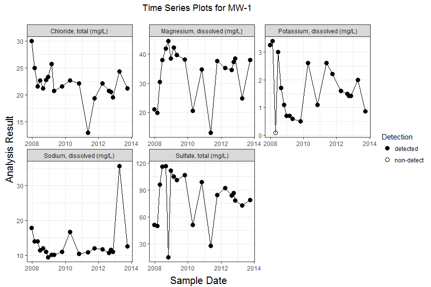
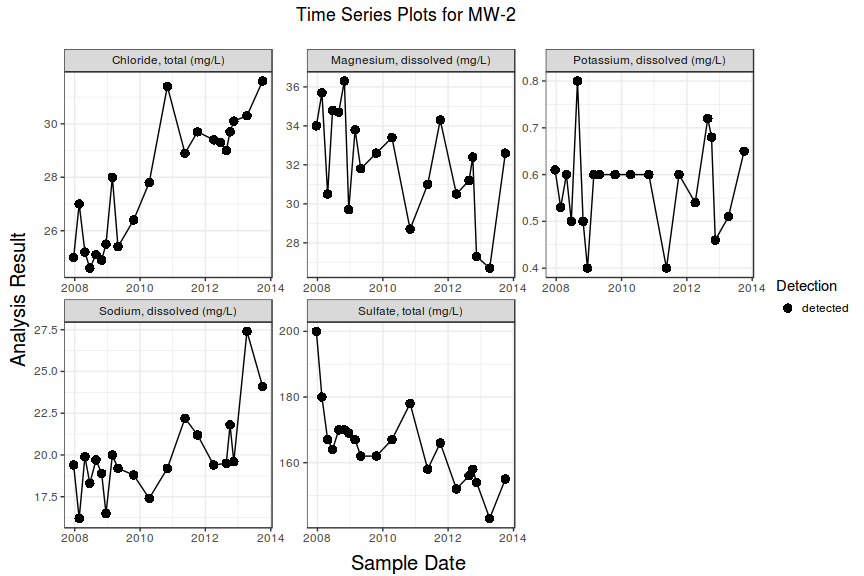
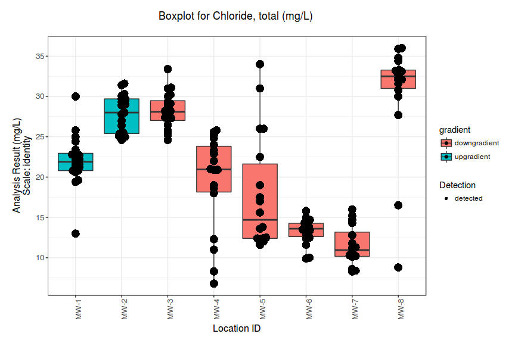
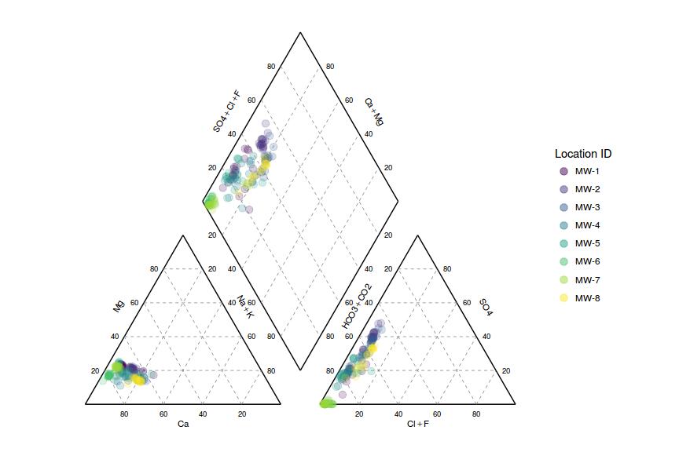

<!-- README.md is generated from README.Rmd. Please edit that file -->
[](https://travis-ci.org/jentjr/manager) [](https://ci.appveyor.com/project/jentjr/manager/branch/master) [](https://codecov.io/github/jentjr/manager?branch=master)

Overview
--------

The goal of manager is to provide a set of tools to simplify plotting and analyzing groundwater data that is in a [tidy format](https://cran.r-project.org/web/packages/tidyr/vignettes/tidy-data.html). Manager also provides functions to read data from external sources such as MANAGES and gINT.

Example
-------

``` r
library(manager)

# reading data from external sources
data <- read_manages3("C:/path/to/Site.mdb")
```

``` r
# load example data and plot time series of selected wells and constituents
data("gw_data")
wells <- c("MW-1", "MW-2")
params <- c("Magnesium, dissolved", 
            "Sodium, dissolved", 
            "Chloride, total", 
            "Sulfate, total", 
            "Potassium, dissolved")

gw_data %>%
  select_all(., toupper) %>%
  filter(LOCATION_ID %in% wells, PARAM_NAME %in% params) %>%
  ts_plot(., facet_var = "PARAM_NAME", group_var = "LOCATION_ID")
```



``` r


# create boxplots filled by gradient
gw_data %>% 
  select_all(., toupper) %>%
  filter(PARAM_NAME == "Chloride, total", 
         LOCATION_ID %in% c("MW-1", "MW-2", "MW-3", "MW-4", "MW-5", "MW-6", "MW-7", "MW-8")) %>%
  mutate(gradient = if_else(LOCATION_ID %in% wells, "upgradient", "downgradient")) %>% 
  boxplot(., fill = "gradient")
```



Create Piper plots...

``` r
gw_data %>%
  select_all(., toupper) %>%
  piper_plot()
```



Installation
------------

To install the `manager` package you must first make sure you have a working development environment.

-   **Windows**: Install [Rtools](http://cran.r-project.org/bin/windows/Rtools/).
-   **Mac**: Install Xcode from the Mac App Store.
-   **Linux**: Install a compiler and various development libraries (details vary across differnet flavors of Linux).

Then, install the `devtools` package from CRAN with

``` r
install.packages("devtools")
```

After you have `devtools` installed you can install `manager` using the command

``` r
devtools::install_github("jentjr/manager")
```

Eventually, the package might be submitted to CRAN, but until then you'll have to install with `devtools`.

Shiny App
---------

A [shiny app](http://shiny.rstudio.com) is included with the package. It can be launched locally by running `manager::manager()`, or you can browse to the [shinyapps.io](http://shinyapps.io) website for [manager](http://jentjr.shinyapps.io/manager). In order to read a MANAGES, or gINT database you must be running a local server with `RODBC` installed. `R` must either be in 32-bit, or 64-bit mode depending on which drivers are installed for microsoft access. MANAGER has only been tested in 32-bit mode.
